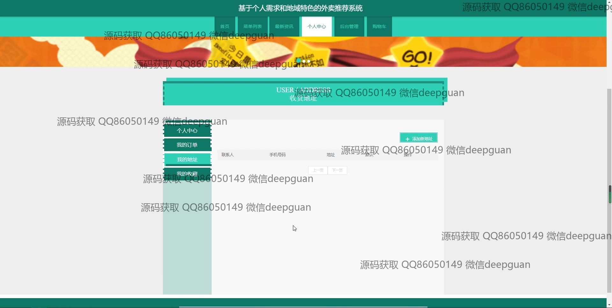
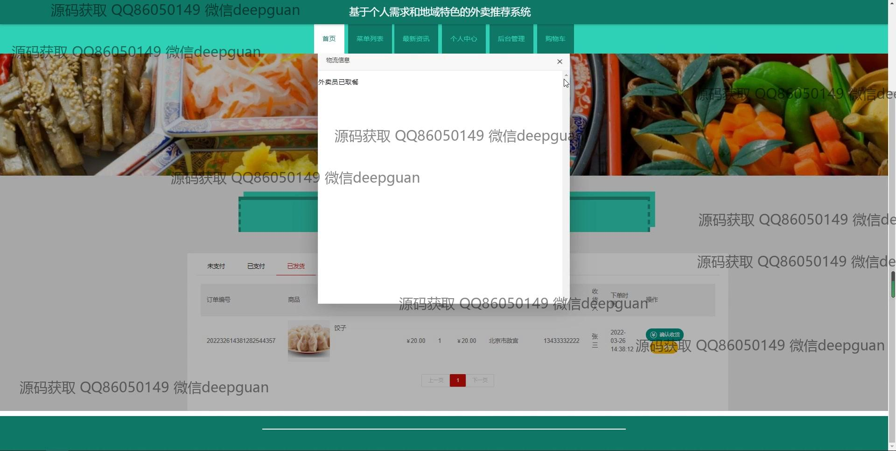

<h1 align="center">基于个人需求和地域特色的外卖推荐系统</h1>

## 简介
基于个人需求和地域特色的外卖推荐系统：角色分为管理员、用户；具备用户管理、商家管理、订单管理、城市管理、个性化推荐等功能，实现便捷外卖服务和精准推荐。    --计算机毕业设计源码；毕设源码；java毕业设计源码

## 联系方式

<h3 align="center">获取完整代码与数据库文件 + 微信：deepguan QQ: 86050149 QQ群: 783742310</h3>

<h3 align="center">可帮忙远程部署 包运行成功！提供远程部署、修改代码、设计文档指导、代码讲解等服务！</h3>

## 功能介绍（完整见运行截图）
管理员： 管理员通过系统管理模块可以登录并进行后台管理，能够管理用户信息、商家信息以及城市和系统分类。管理员可以编辑订单信息，包括查看、修改、删除订单，并处理订单的支付和状态变更。此外，管理员还可通过商家管理页面审查和编辑商家信息，确保外卖推荐的准确性和可操作性。

商家： 商家通过专用页面注册并上传店铺图片和信息，包括店铺名称、地址、口味分类等，同时可以设置和管理菜品的详细信息与价格。系统为商家提供一个便捷界面来审核订单，确保及时处理和配送，并让商家能够查看店铺的经营业绩与用户反馈。商家上传的菜单信息也加入系统为用户推送的外卖推荐列表中。

用户： 用户在系统中可以注册并登录，随后进入个人中心管理个人信息，可以添加和修改收货地址。通过系统提供的推荐服务，用户查看菜品详细信息并根据个人口味和地域特色选择外卖。用户可以管理购物车，查看和生成订单，选择支付方式，并可在订单管理中查看订单历史和状态，同时能进行产品评价和互动。

系统： 系统采用SSM框架开发，提供了简单易用的首页，用户可通过导航栏快速访问不同模块，如菜单列表、推荐菜品和个人中心。系统为用户实现个性化推荐，基于用户收藏和地域特色提供外卖选项，并支持用户进行外卖的便捷下单和支付。用户和商家通过系统的标准接口交互，提高具有地域特色和个人需求的外卖服务体验。

## 运行截图

本代码来源于网络,仅供学习参考使用!

